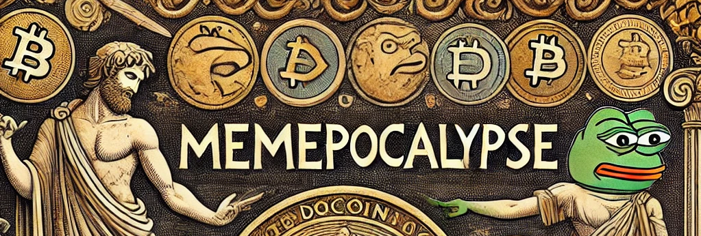

# Memepocalypse (MEMEPOC)

**Powered by AI, Inspired by Memes**

---

## Overview

Memepocalypse (MEMEPOC) is a project dedicated to preserving and documenting the cultural evolution of memes. From ancient graffiti to the recent boom in meme coins on the Solana blockchain, Memepocalypse explores how memes have influenced humor, art, and financial markets across history.

---

## The Evolution of Memes and the 2024 Tsunami of Meme Coins

### Introduction to Memes
Memes have long served as symbols of cultural exchange, transcending mediums from ancient artifacts to the digital age. Modern meme culture has evolved from historical symbols, graffiti, and expressions to internet memes and, more recently, crypto-related memes.

### Timeline of Memes

- **Earliest Memes**
  - **Ancient Roman Graffiti (79 CE, Pompeii):** Graffiti preserved from the volcanic eruption of Pompeii showcases early humor and social commentary.
  - **Ancient Egyptian Hieroglyphs (c. 3200 BCE):** Hieroglyphs in Egypt depicted animals performing human tasks, reflecting an early form of humor.

- **Historical Memes**
  - **Kilroy Was Here (1940s, WWII):** A simple cartoon figure with "Kilroy Was Here" became a viral symbol during WWII.

- **Early Internet Memes (1990s-2000s)**
  - **Dancing Baby (1996):** One of the first viral digital memes, a 3D-rendered baby animation, became a pop culture sensation.
  - **All Your Base Are Belong to Us (2000):** This phrase from the video game *Zero Wing* became iconic in early internet meme culture.

- **Modern Internet Memes (2010s)**
  - **Pepe the Frog (2010):** A widely recognized meme originating from Matt Furie’s comic.
  - **Distracted Boyfriend (2017):** A stock photo-based meme symbolizing shifting priorities in humorous scenarios.

- **Meme Trends (2020-Present)**
  - Short-form videos and challenges have taken over meme culture on platforms like TikTok, with memes evolving into interactive entertainment.

### The Rise of Crypto Memes

- **Dogecoin (2013):** Originally a joke, Dogecoin has grown into a popular cryptocurrency with strong community-driven value.
- **Shiba Inu (SHIB) (2020):** Dubbed the “Dogecoin Killer,” Shiba Inu gained popularity following Dogecoin’s success.

### The 2024 Tsunami of Meme Coins on Solana
In 2024, Solana became the go-to platform for meme coins due to its low fees and high transaction speeds. Notable meme coins include:

1. **PEPECOIN:** Inspired by the Pepe the Frog meme, this coin gained significant social media traction.
2. **DOGE V2:** An improved version of Dogecoin, launched on Solana.
3. **LOLToken:** Integrated social media features and meme-sharing rewards.

### Conclusion
Memepocalypse (MEMEPOC) explores how memes have grown from humorous expressions to cultural icons impacting both art and finance. The 2024 meme coin surge on Solana is a testament to the viral nature of meme culture.

---

### References & Links

1. Richard Dawkins, *The Selfish Gene* (1976)
2. [History of Kilroy Was Here](https://en.wikipedia.org/wiki/Kilroy_was_here)
3. [Dogecoin History](https://dogecoin.com/)
4. [Shiba Inu Coin](https://shibatoken.com/)

---

For a full exploration of the history and impact of memes, download the [Memepocalypse Document](path/to/meme_history_expanded.docx).
